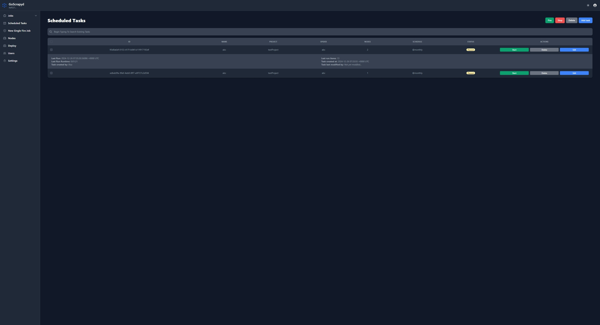

# Goscrapyd 

*GoScrapyd* is a web-based cluster management tool designed to simplify the management and monitoring of your Scrapyd instances. Built almost entirely in Go, it provides a modern, user-friendly interface with enhanced security and advanced features.

---

## Features

- Light/Dark mode UI
- User accounts (privileged/unprivileged)
- Persisted settings (settings automatically applied to every task/spider run)
- Job lifecycle tracking (tracks which user started each job/task)
- Text search for tasks/jobs
- Native support for HTTPS via [Let's Encrypt](https://letsencrypt.org/) certificates

---

## Run Locally

1. ***Install [Go](https://go.dev/dl/)***

2. ***Clone the repository***

3. ***Run `go mod tidy` from the cloned repository***

4. ***Build the executable by running `go build -o <desired_executable_name_here> .\cmd\web\`***

5. ***When running the program for the first time, use the command `<your_executable_here> -create-default-user` to 
create a default `admin:admin` user account. This account can be used for first login***. _Once logged in you have the ability to
easily create more of them and/or_ ***secure this one with a better password and username via the Web UI***

6. ***See [Environment variables](#environment-variables) for other settings that should be configured***

---

## Environment Variables

***The `python-path` environment variable is required, and it should point to a Python interpreter on your system.***

- ***The following environment variables are optional, but by default, they are insecure. It is strongly recommended that you change them:***

    - ***`cookie-secret-key`*** - A secret key used for encrypting or signing cookies. Change this to a strong, random value for better security.
    - ***`session-secret-key`*** - A secret key used to protect/secure user sessions.
    - ***`scrapyd-secret`*** - If your Scrapyd nodes are authenticated, this secret is used to encrypt your Scrapyd credentials at rest in the database.

_For all environment variables, please refer to [`main.go`](cmd/web/main.go)._

_If you're interested in running an HTTPS server, please also check [`server.go`](cmd/web/server.go) in addition to [`main.go`](cmd/web/main.go). Basic familiarity with Go is expected, as detailed instructions are not currently provided for this._

